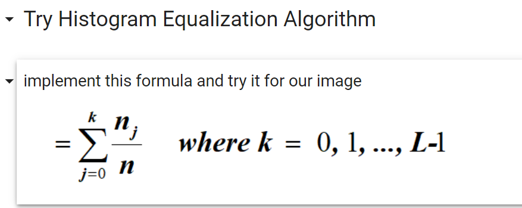

# ImageProcessing-ComputerVision
### Using classic computer vision technique (Histogram Equalization) for image enhancement

## Goal
This repository contains the implementation of the Histogram Equalization algorithm for image enhancement as part of a computer vision course assignment. It includes a comparison between the results obtained from the custom implementation and the Pillow library's `ImageOps.equalize` function.

## Implementation

The custom implementation of histogram equalization was done in Python using NumPy, while the Pillow library's `ImageOps.equalize` function was used for the comparison. The process involves the following steps:

1. Compute the histogram of the input image.
2. Calculate the cumulative distribution function (CDF) of the histogram.
3. Map the CDF values to the intensity levels to create a new intensity mapping.
4. Apply this mapping to the input image to obtain the enhanced image.

## Result

Before            |  After            | Pillow HistEQ Result
:-------------------------:|:-------------------------:|:-------------------------:|
  |   | 
